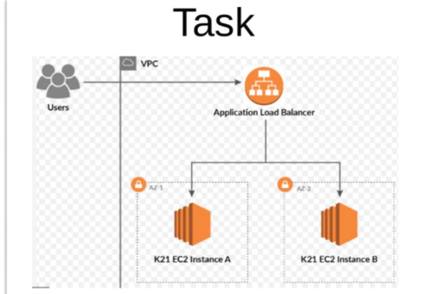
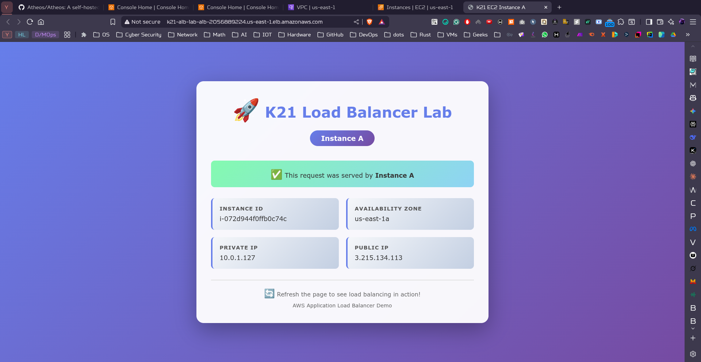
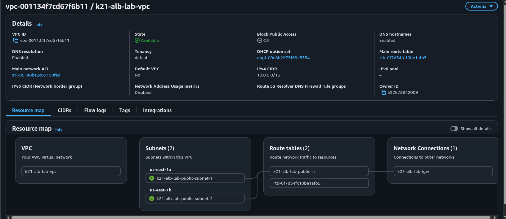

<h1 align="center"> Deploying EC2 Instances Behind an Application Load Balancer </h1>

<p align="center">
  
<p/>

---

### Initialize Terraform

```bash
cd tf
terraform init
terraform validate
```

### Plan the Deployment

```bash
terraform fmt
terraform plan
```

### Deploy the Infrastructure

```bash
terraform apply
# or 
terraform apply -auto-approve
```

### Access the Application

Get the ALB URL

```bash
terraform output alb_url
```

```bash
"http://k21-alb-lab-alb-2056889224.us-east-1.elb.amazonaws.com"
```
Test the application

```bash
curl http://k21-alb-lab-alb-2056889224.us-east-1.elb.amazonaws.com

```

---

### Project Structure

```
Lab-18/
├── README.md              # Lab overview and objectives
├── imgs/                  # Architecture diagrams
│   └── 1.png             # Lab architecture diagram
└── tf/                    # Terraform configuration
    ├── main.tf           # Provider configuration
    ├── variables.tf      # Input variables
    ├── vpc.tf            # VPC and networking
    ├── security_groups.tf # Security groups
    ├── ec2.tf            # EC2 instances
    ├── alb.tf            # Application Load Balancer
    ├── outputs.tf        # Output values
    ├── terraform.tfvars  # Variable values
    ├── user-data.sh      # EC2 initialization script
    └── .gitignore        # Git ignore rules
```

---


### Clean Up

```bash
terraform destroy
# or 
terraform destroy -auto-approve
```

---


<p align="center">
  
  
  
<p/>
